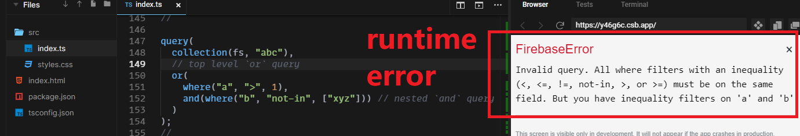

<!-- markdownlint-disable MD010 -->
<!-- markdownlint-disable MD033 -->
<!-- markdownlint-disable MD041 -->

		
		<h1>FirelordJS 烈火君JS</h1>

		
			&nbsp;
			
			&nbsp;
			
			&nbsp;
			
			&nbsp;
			
			&nbsp;
			
			&nbsp;
			<a href="https://github.com/tylim88/Firelordjs/issues" target="_blank">
				</img>
			</a>
			&nbsp;
			

 

		<i>High Precision Firestore Web Typescript Wrapper, Providing Unparalleled Type Safety and Dev Experience</i>

 

		<i>Modular, Minuscule, Intuitive, Unopinionated, Craftsmanship, Ultimate, Peaceful, Deep</i>

 

	<i>Of The VFQAT &#160;&#160;&#160;&#160;&#160;||&#160;&#160;&#160;&#160;&#160; By The VFQAT &#160;&#160;&#160;&#160;&#160;|| &#160;&#160;&#160;&#160;&#160; For The VFQAT</i>

 

	<i>Be The Master Of Your Fire, Be Firelord</i>

 

	<i>Beyond Typing</i>

 

<a href="https://firelordjs.com/quick_start" target="_blank" style="color:blue"><strong>Doc</strong></a>

 

# FirelordJS

FirelordJS is the only library capable of providing insane type safety while exposing almost all the API of the official Firestore SDK. The goal is to end Firestore typing madness.

FirelordJS:

- Learning curve is the lowest (API is nearly identical to the original API).
- Technical debt is the lowest (easy to revert to the official API).
- Offers truly generic type safe solutions, see [Transformative Type](https://firelordjs.com/highlights/type_conversion).
- Package size is the [smallest](https://firelordjs.com/minified_size).
- Needs **no** code generation and schema language, just pure Typescript.
- Supports [@firebase/rules-unit-testing and emulator](https://firelordjs.com/guides/tests), tested with emulator and no extra API is needed!
- Is thoroughly tested, we test beyond source code, we test built files and published package. (test source code -> build -> test built files -> publish -> test published)
- Does not do mock test, all 250 tests test against live database to ensure the highest certainty.
- Takes care of annoying runtime errors like empty array errors([filter](https://firelordjs.com/highlights/where#dealing-with-empty-array-%EF%B8%8F) & [cursors](https://firelordjs.com/highlights/cursor#empty-rest-parameter)) and [implicit data deletion in update operation](https://firelordjs.com/highlights/update#implicit-data-deletion) for you.
- Remove the need to write collection ID.
- Blocks undocumented errors and provides over [30 custom error messages](https://github.com/tylim88/FirelordJS/blob/main/src/types/error.ts) to assist you in writing proper Firestore code! Here is an example:
  

FirelordJS is the only library capable of **[typing against](https://firelordjs.com/highlights/query_rule_typing)** Firestore limitations. I am confident it has the best type safe and nothing come close. I put money on my words and I will buy you [x cups of coffee](https://www.buymeacoffee.com/) if you:

1. found something better: 75 cups
2. created something better: 1000 cups (you don't need to a make full fledge library, something that is minimally better is enough, open an issue if you want to take this challenge)

## Nested Composite Query Rulings (v2.5+)

Rulings for `or` & `and` composite query are ready, rulings works with nested query, example:

Official SDK runtime error:  

Firelord compile time error:  

It has all the regular rulings plus new composite rulings. See also [peeling composite query error messages](https://firelordjs.com/guides/understanding_error#peeling-composite-query-error-messages)

## NextJS TroubleShooting

[Use FirelordJS in NextJS](https://github.com/tylim88/FirelordJS/issues/95)

## TO DO

- Mandatory field update. Example, for field like `updatedAt`, it is mandatory to includes it every time you update the document. There are two ways to implement these feature: via Meta Type and via abstraction. With Meta Type(using special field value), it is less flexible because we no longer able to exclude it from all update operations. With abstraction, it is more flexible but require more works from user. I prefer via abstraction due to it does not shut down other use cases despite having lower user experience.

- Support tuple data type.

- Replace `set merge` with `upset`(update if exists, else set). It will receive 1 doc ref argument and 2 data arguments(partial data and complete data). It will attempt to update the document with partial data or create a document with complete data if the document does not exist.

- Fix in code documentation not working(alternative solution is available, [TS bug?](https://github.com/microsoft/TypeScript/issues/53424))

## Dropped TO DO

- Support for wide numeric key and wide string key (Record<number, unknown> and Record<string, unknown>). It still needs more consideration because this data type is pointless to query(we need to know what the key is first, it would be better to just save the document ID somewhere) and we need to constantly aware of the document size limit. If you don't care about query and you sure that the size limit will not exceed 1 MB, then this is for you. But allowing this also open up for mistake and bad practice for those who are not aware. Most likely I will not implement this but will give it deeper thoughts in the future.

- Support for object unions type. Objects unions type seem to be a good type to have in NoSQL database because of how ever-changing NoSQL schema is. However, this is not the case because it brings uncertainty that cannot be handled reasonably. For example, with `{a:number}|{b:string}`, you can set `{a:1}` then update `{b:"x"}`, in this case the type is no longer unions type but an intersection type: `{a:number} & {b:string}`. So I will not implement this feature and will remove it from [FireSageJS](https://github.com/tylim88/FireSageJS) too. A better way to solve this is to use [`PossiblyReadAsUndefined`](https://firelordjs.com/guides/possibly_read_as_undefined) label on newly add field instead(you can also label abandoned fields as `PossiblyReadAsUndefined`, but an easier way is to totally ignore them).

- Support for optional (`?` modifier). Optional is a highly requested feature because of how common it is, however because of how Firestore works: it is impossible to query a missing field. Example: it is impossible to query user that has no phone number if phone number field does not exist. Because of this, it is important to make sure every field exists. You may not need the field now, but you may need it later plus adding default value is simple, especially with such powerful typing library like Firelord. So in order to not accidentally cripple your query in the future, I will not implement this feature. Yes, set merge basically lead to the same problem, hence I encourage you to use `upset` instead (will be available in the future).

- Narrow read type base on query constraint. For example `where('a', '==', true)` will narrow the read type of field `a` to `true`, it should be able to narrow down complex case like `where('a.b.c', '==', { d:[{e:1}] })`. Expected to support `==` comparator for all types and _possibly_ `!=` comparator for literal type(type filtering for`!=` comparator poses great complexity hence I may not work on it). Update: I decided to give this up because with the introduction of composite query, it will be extremely difficult to implement this. Plus unlike narrowing down write type, narrowing down the read type does not contribute to type safety, it just makes thing slightly simpler(skip exhaustive check).

### Possible Architecture Changes in V3

Firelord follows a type-first approach, which means that every entity starts with a type. While this approach has its benefits, it can be seen as objectively inferior to a code-first approach since we can always infer types from code(with code-first approach), but not the other way around(with type-first approach). A good example of this is tools that build on top of `zod`, like [trpc](https://github.com/trpc/trpc), which provides both validation and type inference, but this is not possible for Firelord.

Some may question why embedded validation is necessary for databases API, as they are not endpoints(where data validation usually takes place). However, Firestore is a database that directly interacts with clients. Therefore, it is necessary to have validation for triggers, as security rules may not always suffice and do not have type safe.

Type-first approach offers better developer experience, but it cannot do anything at runtime. On the other hand, the code-first approach may require some initial trade-offs in developer experience, but it can be more adaptable in the long term.

## Trivial

- The name Firelord is a reference to the [Firelord](https://avatar.fandom.com/wiki/Fire_Lord) of Avatar.
- Undocumented releases are README updates.
- [Contributing](https://firelordjs.com/contributing).

## Related Projects

1. [Firelord](https://github.com/tylim88/Firelord) - Typescript wrapper for Firestore Admin
2. [FireSword](https://github.com/tylim88/firesword) - Filter Firestore and RTDB Unknown Keys.
3. [FireCall](https://github.com/tylim88/FireCall) - Helper Function to write easier and safer Firebase onCall function.
4. [FireSageJS](https://github.com/tylim88/FireSageJS) - Typescript wrapper for Realtime Database
